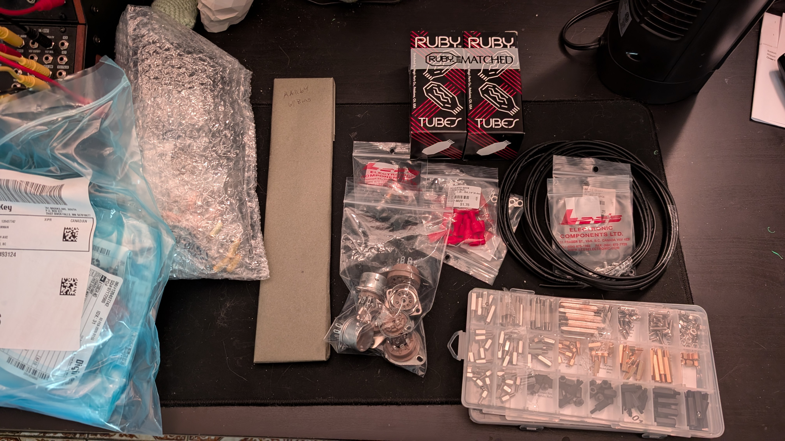
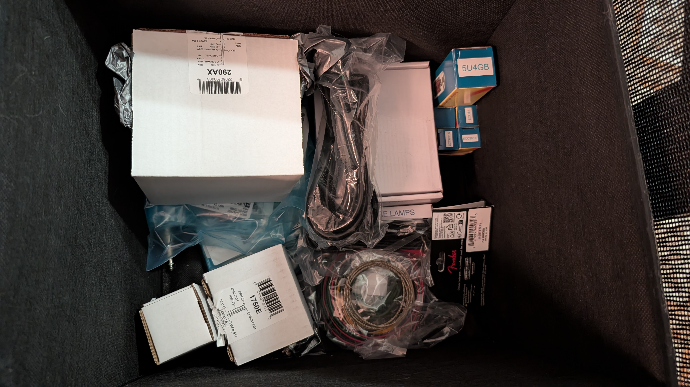
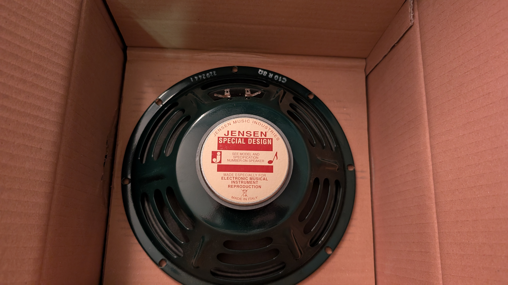
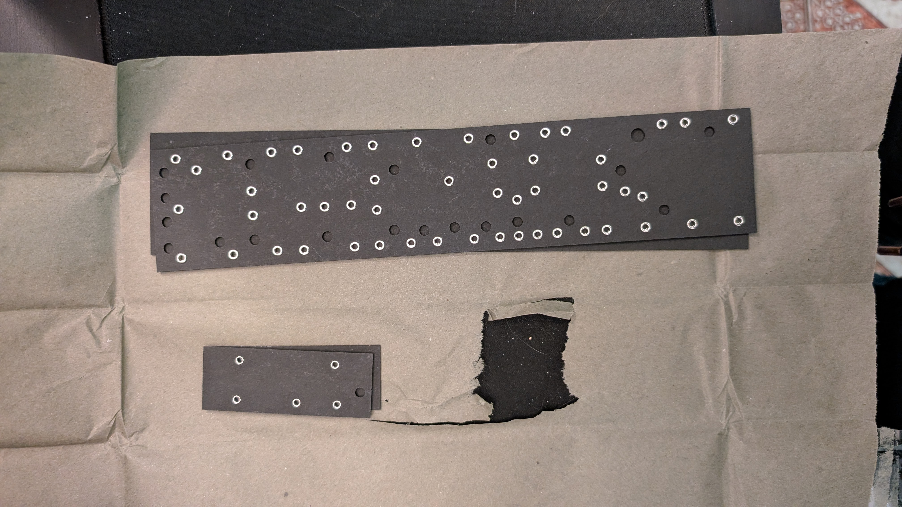
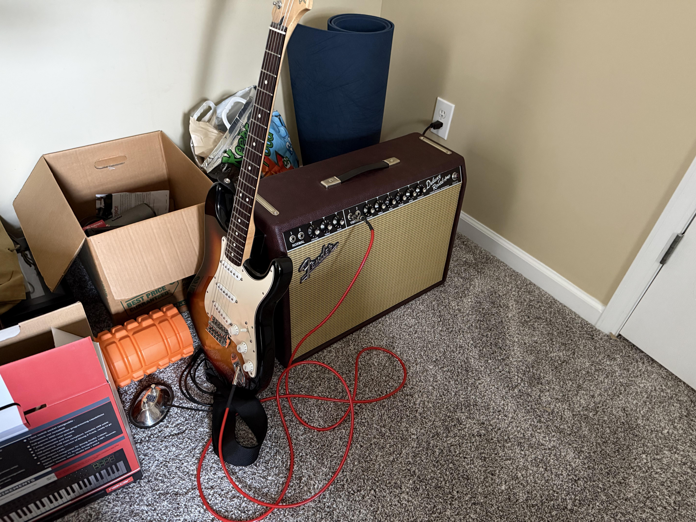
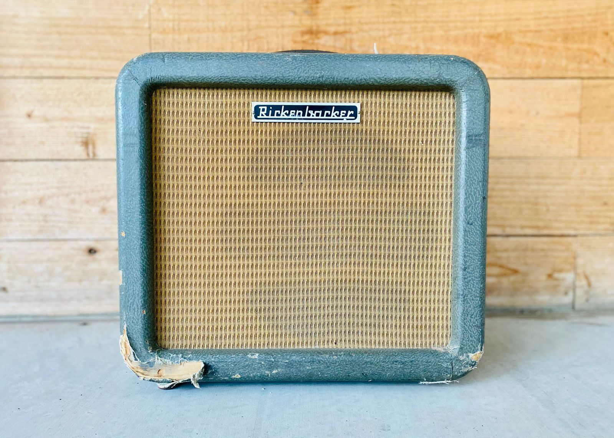
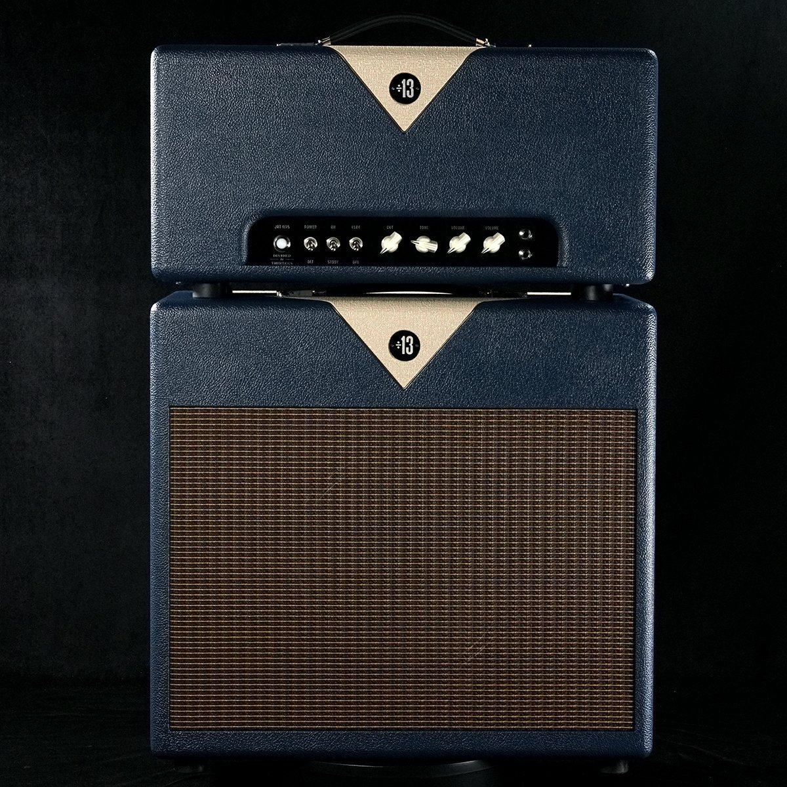
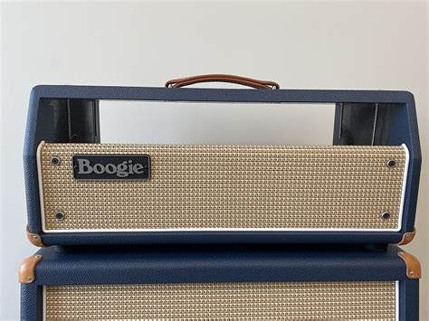
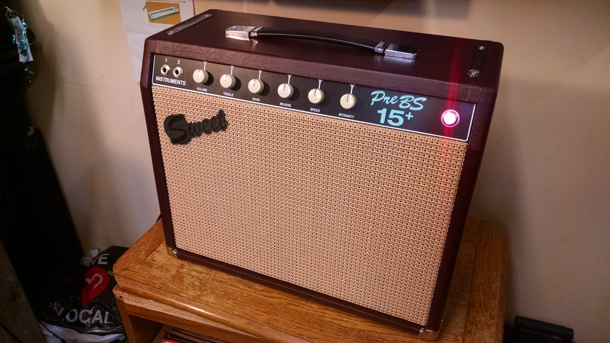

## Finally

I have now received all of the electronics for my amp, I can start building! I am still leaving the cabinet design for another day, I will post some inspiration later in this post

## The Parts

Here are some pictures of the parts!

The fiberboards took the longest to arrive, despite being tiny they somehow took longer than shipping an entire aluminum chassis across the US. 

Most parts are sourced from Canadian distributors, shoutout Digikey, NextGen, Long&McQuade, thetubestore, and my local electronics shop.

## Cabinet Inspiration

I've sourced out some inspiration for the aesthetic of the amp

I'm leaning toward the navy blue tolex, but I could see the brown also being quite nice. Some sort of dark grill cloth as well will be the move I believe. 

Until next time 