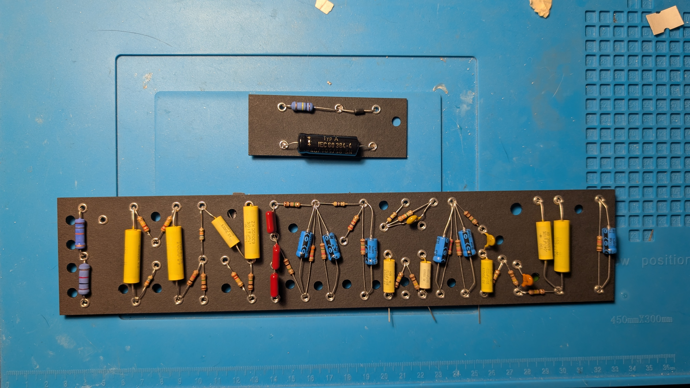
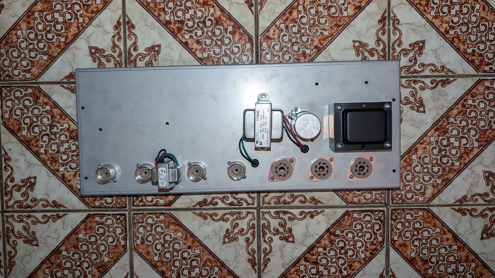
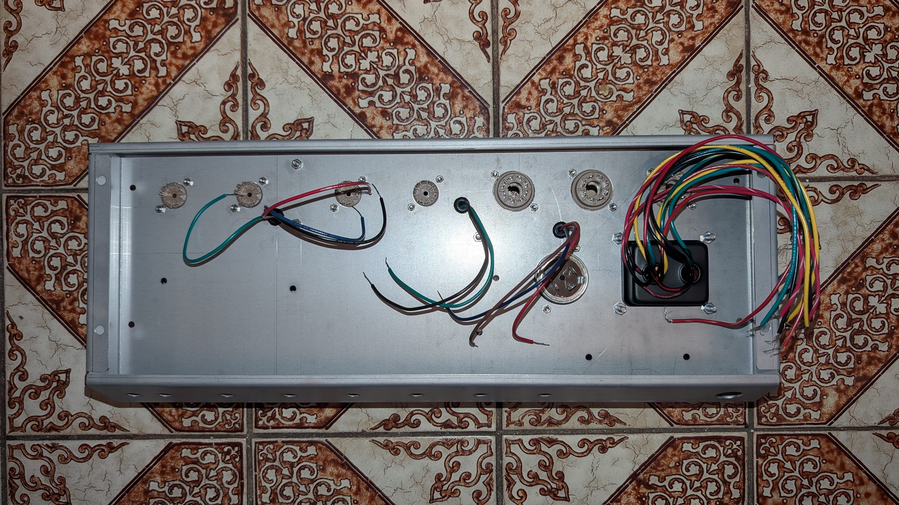

I had some time to start putting together the electronics!

I started with the fiberboard, I placed all the electronics in without soldering. I'll do the soldering once I have the wiring ready. I also plan to test some mods, so I will leave soldering until last. 

Next I installed the transformers, capacitor can, and tube sockets into the chassis. The output transformer holes unfortunately don't line up so I will need to fix that with a drill.

All this plus the sorting took ~3 hours