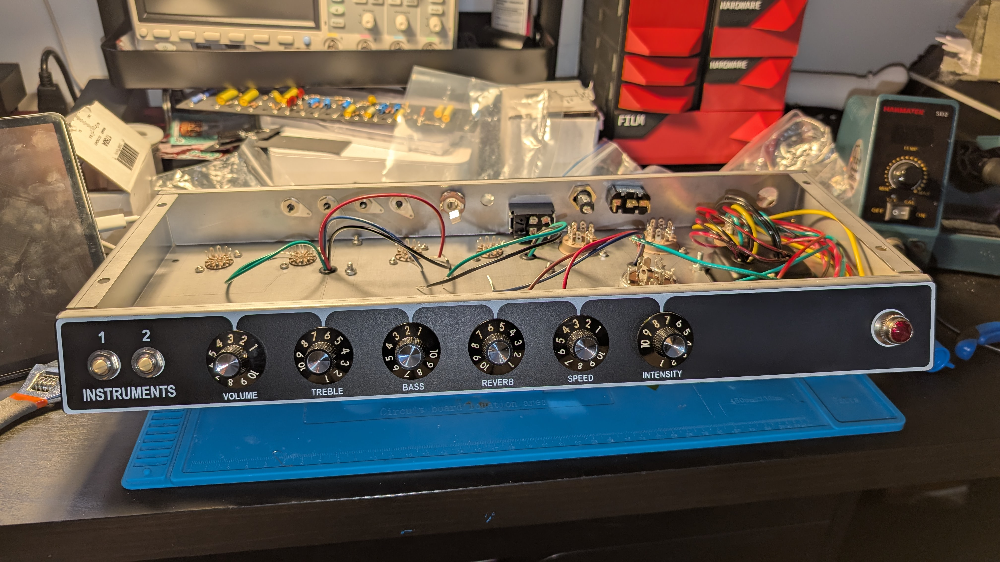
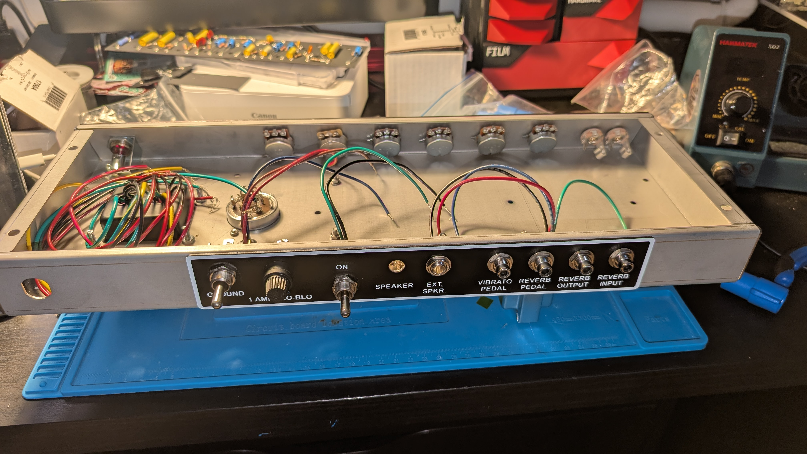
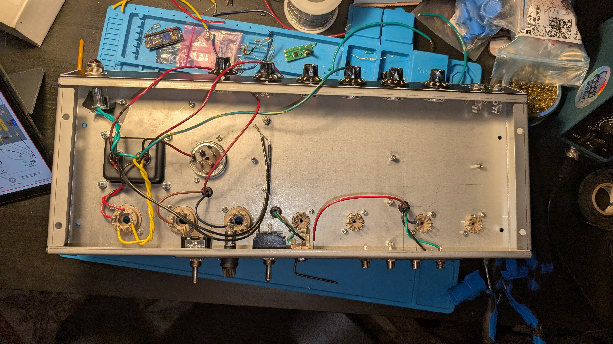
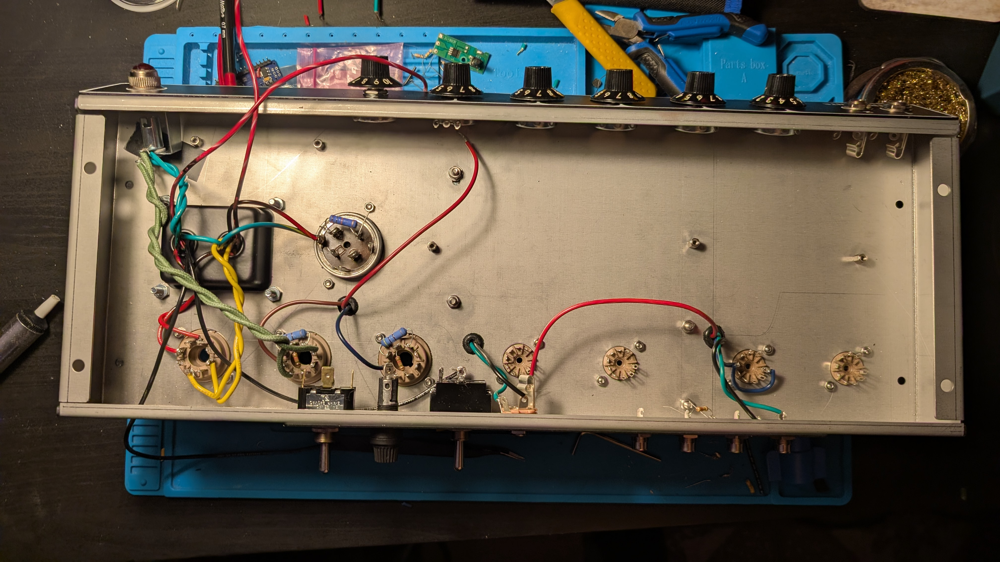
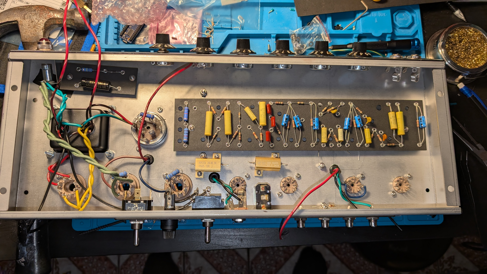
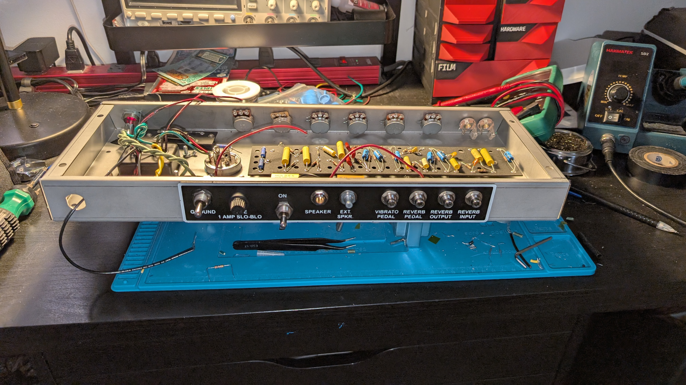
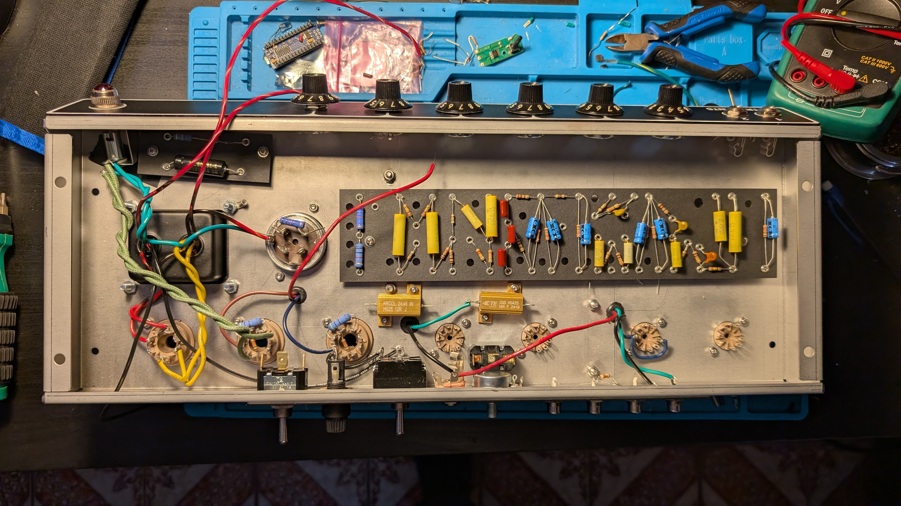

One week of updates in this post

I started by mounting the rest of the hardware to the chassis which gave me a good idea of what the final build will look like and gave me motivation to get working

I then continued wiring the transformer wires

Then I added some of the resistors on the tube sockets

Lastly, I've done a bunch some more wiring, and I drilled the mounting holes on the fiberboard. This was a big learning opportunity, I'm not following a guide and I don't see anyone else talk about this. I should've spent more time measuring where to drill as I had to expand the holes a bit, but in the end I have mounted the boards. 

I also mounted the extra mods that I'm doing. The large power resistors and switch in the bottom middle are for the 10% power mod, when the switch is flicked it outputs almost all of the power through the resistor instead of the speaker. 
The potentiometer I've placed in the ext. speaker hole is for a pre-Phase-Inverter Master volume. Will I need both a 10% power and master volume mod? Not sure, but I've decided to add both for now. 

I'm prepping everything for wiring, which I'm definitely procrastinating on. 