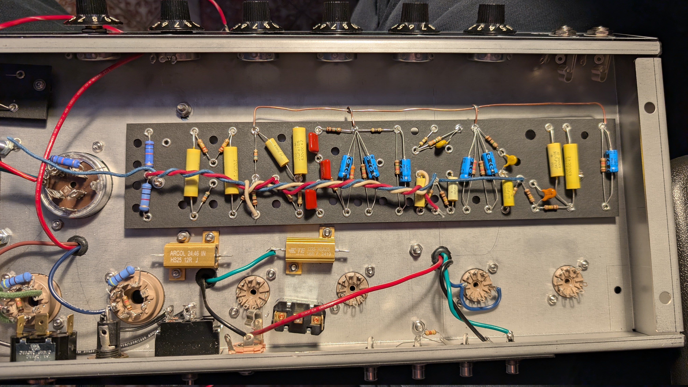
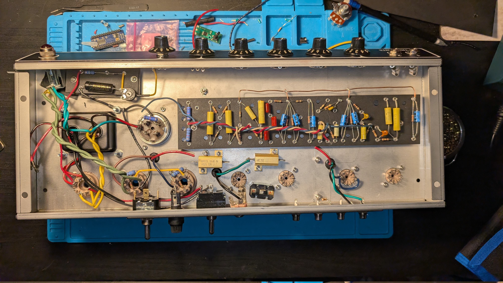
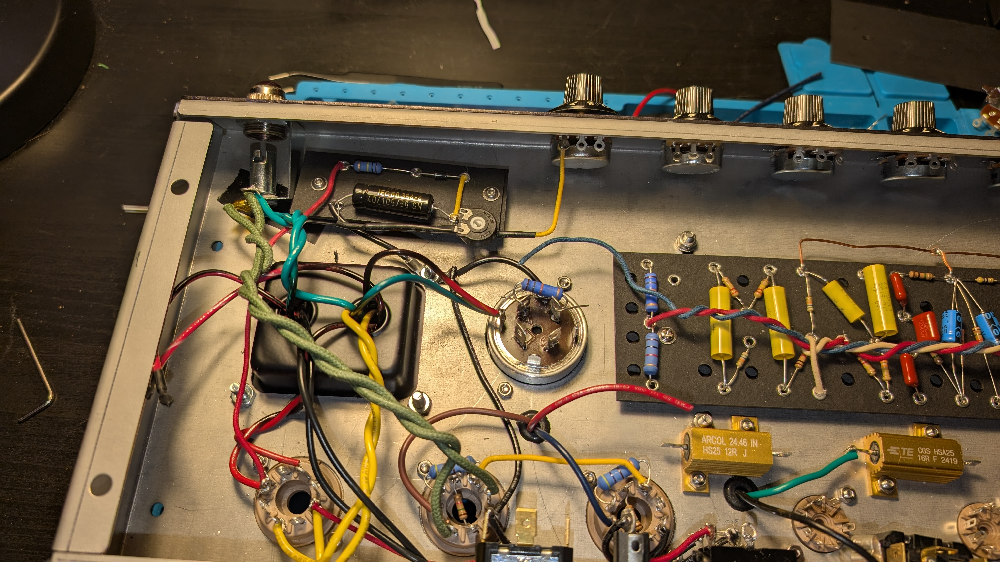
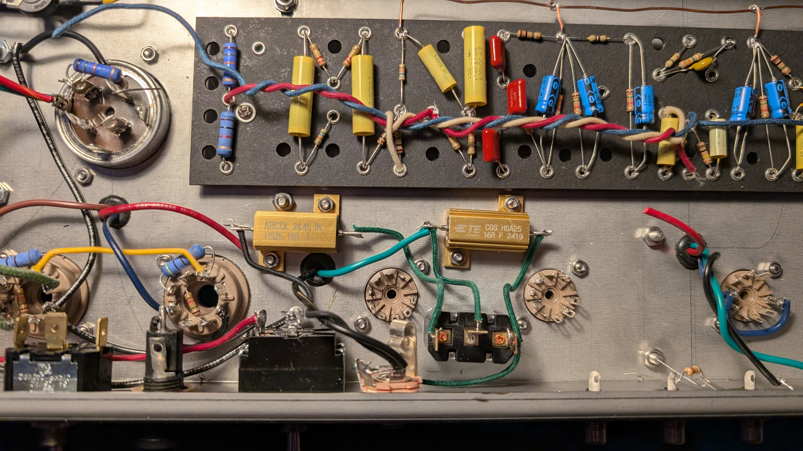
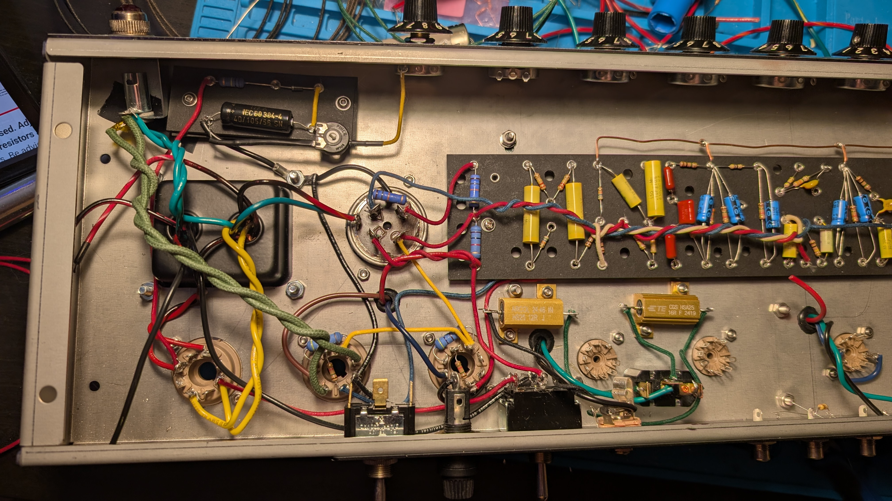
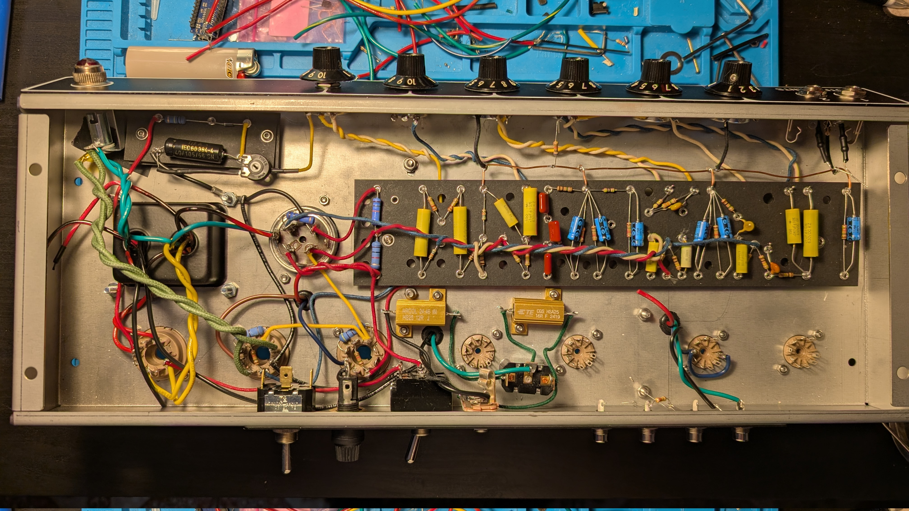
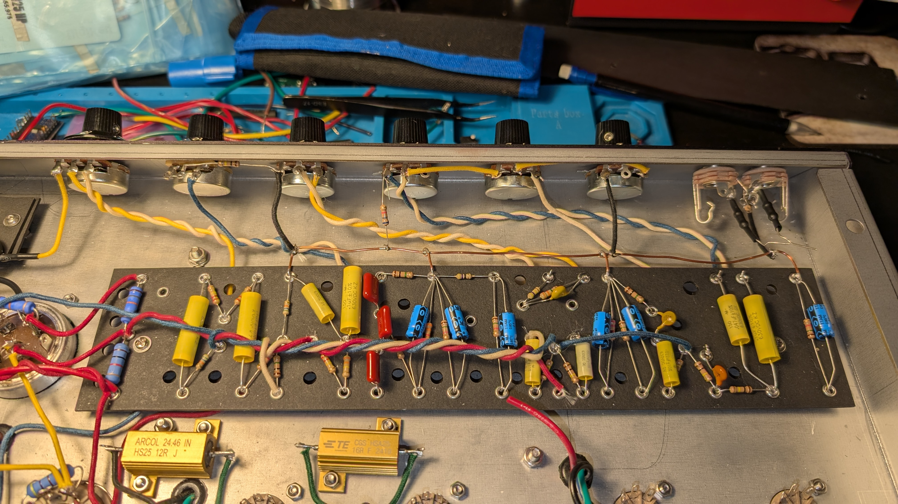
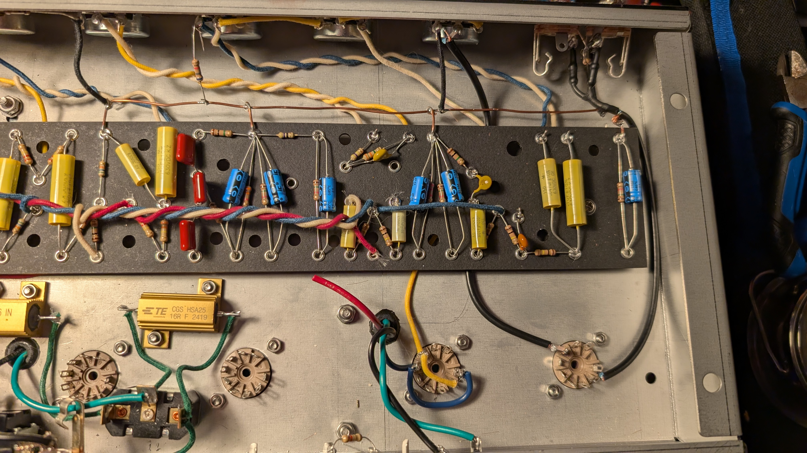
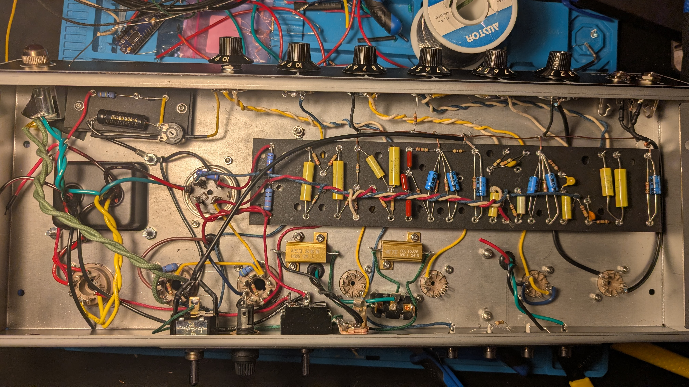

It's been a few weeks! This post will mainly be pictures, I'm still wiring the chassis. 

First up is the twisted cabling over the main fiberboard. These are the B+ voltages 320V, 400V, and 420V.

Next night I worked on this I wired up the bias board in the top left. I tried to keep it tidy, I have the bias pot soldered into one of the holes and the other legs secured by wires. 

Up next I wired the 10% power switch. These wires are meant to stay pretty isolated as they're the last line before the output, after the output transformer. I have them quite close to the tremolo tube which worries me. 

Here I am wiring up more of the power section. Also notice that I moved the 10% power switch wiring so the tremolo tube is avoided. 

I aimed to wire this power section first. 

Next up is the top half, aka the pots and input jacks. Keeping the wires clean up here is best to protect the signals. The two leftmost pots are for the tremolo signal which is a powerful oscillation, best to keep that away from the rest of the signals. 

You can see the two resistors I have heatshrinked from the input jacks. 

And here is the input jack and volume pot wired up with shielded coax cable. This is to protect the input signal as it travels under the fiberboard and into the input tube. 

Latest update, I am now focused on wiring all of the signals that come from the center of the fiberboard. This way I can still lift the board to place the wires and solder. I think I have most of that complete now. I've also wired the 'Ground' switch to be an NFB mod, you can see a coax cable come out from the switch and over the board. A little worried about how the output signal goes from the output jack, past the AC lines, and into that switch - but we'll see if it's important later. 

I have all the mods except for the master volume implemented. I didn't implement this because:
1. It's going to add more signal wires crossing the board (noisy)
2. I think I won't need it with the 10% power switch
3. I forgot

I can always add it later if I really feel it necessary...

Now that all the wiring on the top and middle eyelets of the fiberboard are complete, I'll finish the wires between the tubes and the bottom eyelets. Getting closer!