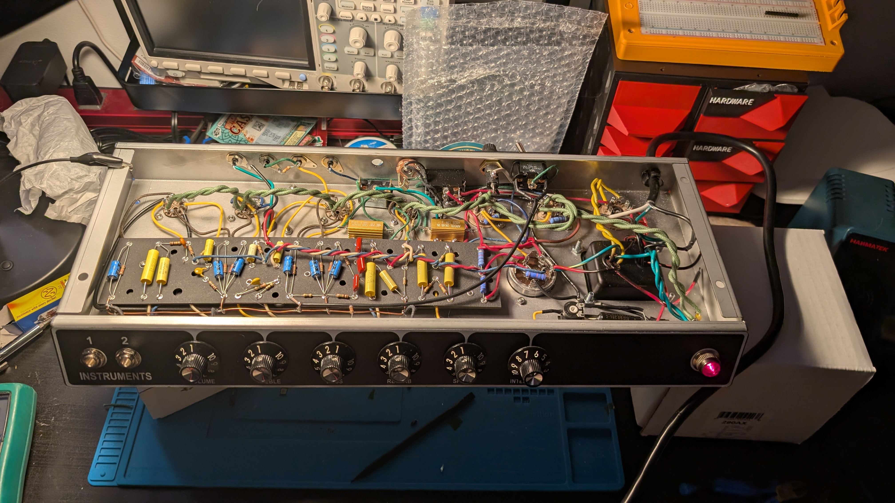
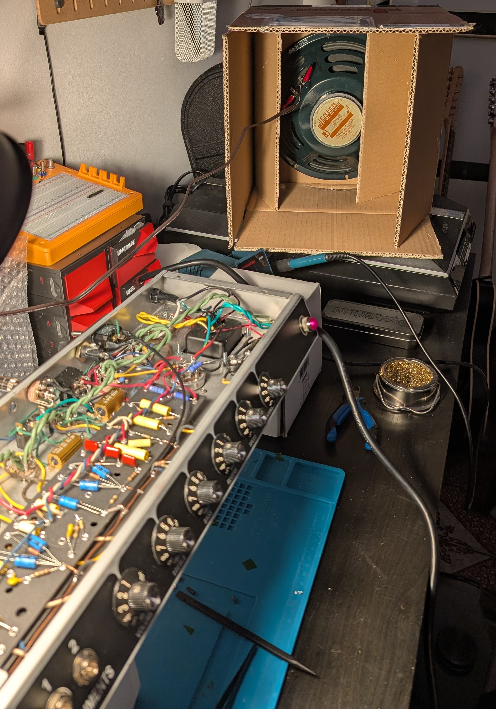
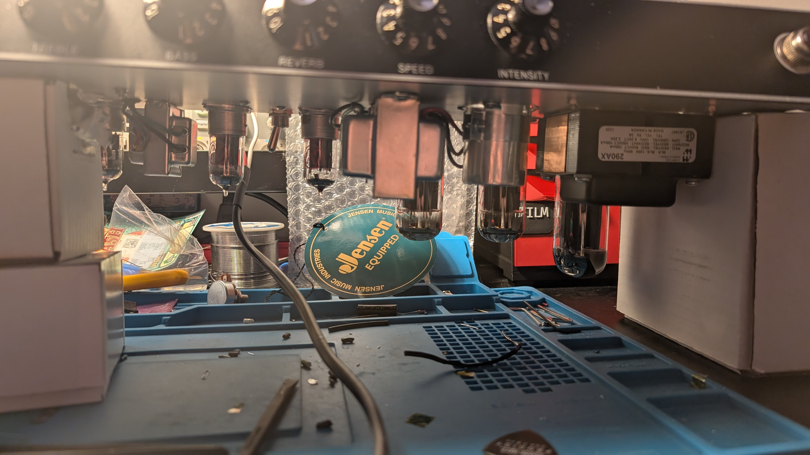

Prepare for takeoff

The amp is wired and ready to rock! Since the last update all I had to do was install the power cable which was a fun experience. Getting the strain relief over the wire into the hole was a lot of squishing and smushing but I finally got it in. 

Once that was in, I did another once-over to double check my connections and wiring. Everything looked clean... time for first power. 

I used Rob Robinette's [first power up](https://robrobinette.com/Tube_Amp_Startup.htm) guide from his website. I did not use a lightbulb current limiter but I did have a Variac. Luckily, I had no shorts.

The power up process for this amp went like this: 

1. Plug amp in to the variac with no tubes. Variac set to 120V AC. 
2. Power on amp to standby, then to fully on. Note voltages on outputs of power transformer. 

    I was getting ~350V on both lines to the center tap of the primary output (red wires) which is higher than expected (~325) but I attributed that to having no load and I moved on. Heater wires were working, light was on!
3. Turned the amp off, installed the rectifier tube. 
4. Turn the amp back on to standby and hope nothing explodes. I then turned standby off. 

    I played around with starting the variac low and raising the voltage but I wasn't seeing results from that, so I turned this on to full 120V after a bit. I saw DC output coming out and the capacitors on the B+ line had the proper voltages!
5. Power off, install the preamp tubes. Power on again

    Again, nothing exploded. I measured some of the voltages on the heater lines and the B+ voltages again. All as expected. 

6. Power off, install the power tubes and plug in the reverb tank and speaker. 

    Scariest power on so far. Something going wrong here could damage the speaker or output transformer. Again, all went well. I turned the volume up slightly from zero and it was extremely quiet, I kind of worried something might be not working. However, when checking voltages on the power tubes I head it, the impedance change on the power line made a slight buzz out of the speaker, exciting!

Now was the time to plug in my instrument. With the volume low I started to strum and I heard it, the beautiful chime of the Jensen CR10. No hum, no squeaks, no rattling, just pure toan. 

Watch the benchtop demo here!
<iframe width="560" height="315" src="https://www.youtube.com/embed/9_g9Jqr82Vg?si=pQ1-SYvExGrWSMGb" title="YouTube video player" frameborder="0" allow="accelerometer; autoplay; clipboard-write; encrypted-media; gyroscope; picture-in-picture; web-share" referrerpolicy="strict-origin-when-cross-origin" allowfullscreen></iframe>

I am extremely satisfied to have this working on the first power up, but I'm not quite done yet. 

I still need to:

1. Bias the power tubes
2. Remove the tremolo depth mod, I don't like it. Anything above 3 on the tremolo intensity is very intense and not very usable for me. This may change after proper biasing however. 
3. Investigate hum with the reverb/tremolo pedal plugged in. 

    This one might be expected, the pedal and cable are acting as an antenna. When the reverb is enabled, the switch is opened and there is a long floating antenna with reverb signal going out of the amp. 
    Otherwise, there is no hum in this amp. I can turn it up to 10 and it's silent. 

Cabinet is next! Stay tuned