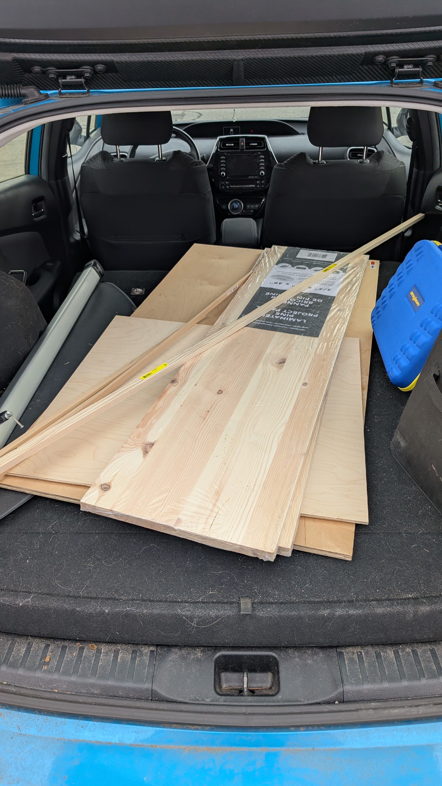
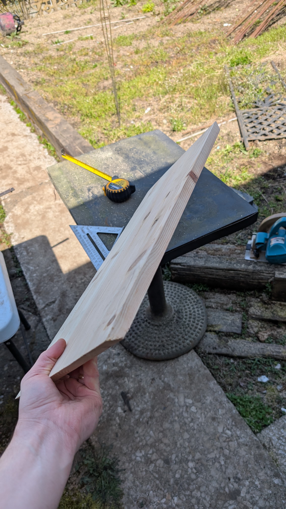
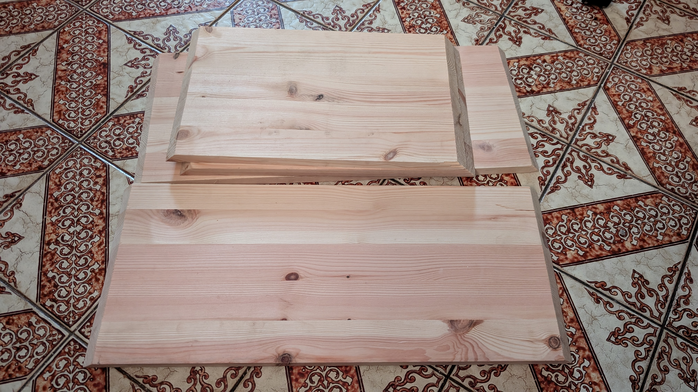

Two Parter this week

# Electronics
Short update here, I biased the tubes very unscientifically. I measured the voltage on the tremolo/bias pot going to the grid leak resistors and played with the tremolo power. I ended up settling on -30V (up from ~-50V) because this sounded good. I had read some comments online where people said they biased this particular circuit based on tremolo power, so that's where I landed. I set the tremolo to intensity knob to 5 and found something that sounded good to my ears. The intensity is now a lot more usable. I also made sure to play it for a bit and check the tubes for red-plating. 

# Wood
Here's the interesting part! 

I feel I've watched enough videos and guides to jump into the woodworking. I went to home depot and picked up enough wood. The [guide I'm following](http://www.brieskorn.de/int/Guitar___Amps/Amp_Projects/AA1164/Princeton_Reverb_Cabinet_1.4_eng.pdf) is all in metric which is annoying because it translates very poorly to inches, which is apparently the universal wood measurement unit. Regardless, I think I got enough.

Using tools I had available, I've started cutting the outer cabinet. I've opted for 45 degree angles because I think that will be a better corner and because I can. 

More updates to come!